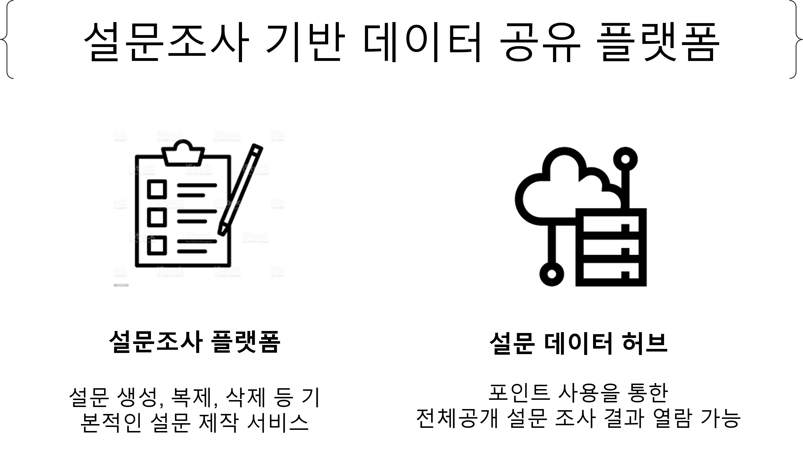

# 설문조사 기반 데이터 공유 플랫폼
## 개요
### 프로젝트 소개

### 기능 소개
0. 로그인, 회원가입, 회원정보수정, 회원탈퇴
1. 설문 생성, 수정, 삭제
2. 답변 생성, 수정, 삭제
3. 생성한 설문 및 답변한 설문 조회
4. 설문 허브 조회 및 구매
5. 그룹 생성, 수정, 삭제
6. 그룹 허브 조회 및 참여
7. 설문 분석
8. 관리자 기능
### 사용 기술
- Frontend: 

- Backend: 

- Database:

- CI/CD:

## 구현
### 1. MSA

|Service|Description|
|---|---|
|[Eureka Server](https://github.com/solbiko/survey_platform_backend_eurekaserver.git)||
|[Gateway](https://github.com/solbiko/survey_platform_backend_gateway.git)||
|[Frontend](https://github.com/solbiko/survey_platform_frontend_react.git)||
|[Auth Service](https://github.com/solbiko/survey_platform_backend_auth.git)||
|[Analysis Service](https://github.com/OYJ-hansung/survey_platform_backend_analysis.git)||
|[Common Service](https://github.com/solbiko/survey_platform_backend_common.git)||
|[Point Service](https://github.com/stella693/survey_platform_backend_point.git)||
|[Survey Service](https://github.com/solbiko/survey_platform_backend_survey.git)||
### 2. System Architecture

### 3. Database
|Analysis DB|Common DB|Point DB|Survey DB|User DB|
|---|---|---|---|---|
||||||

