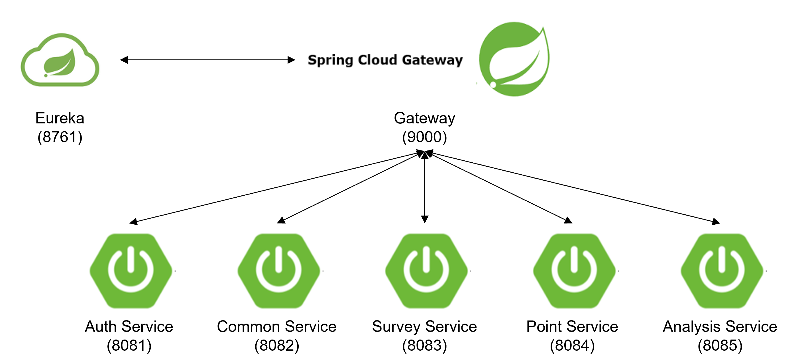
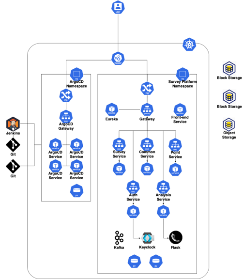
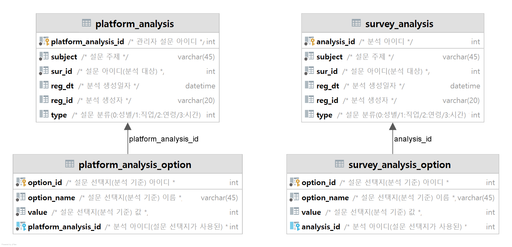
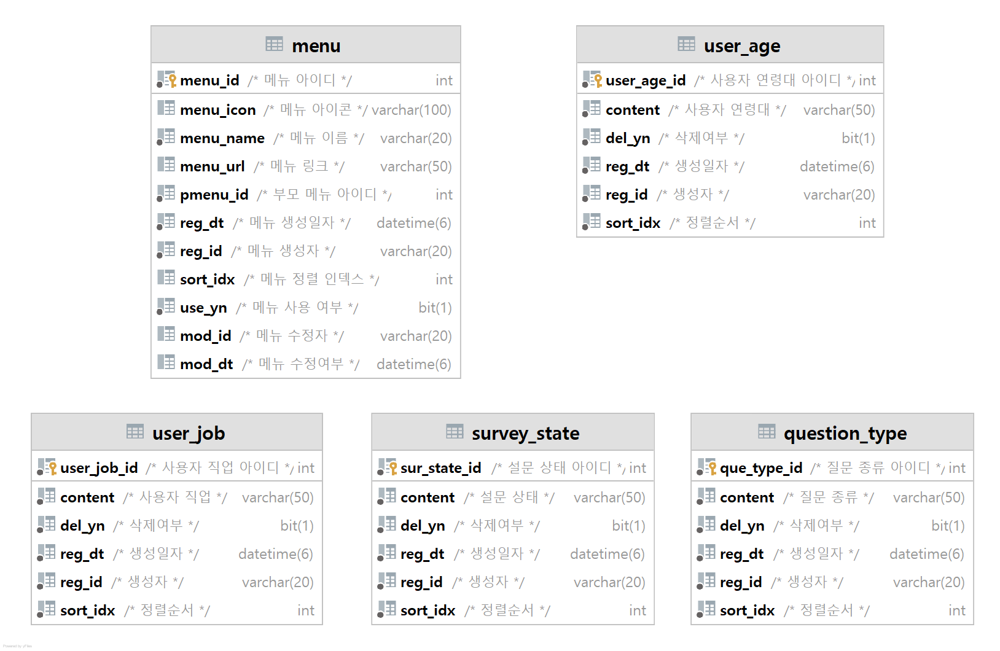
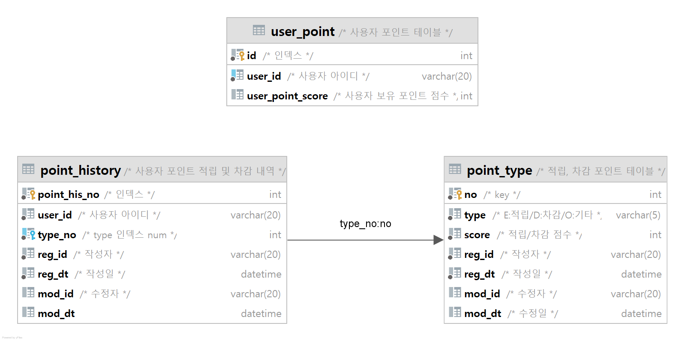
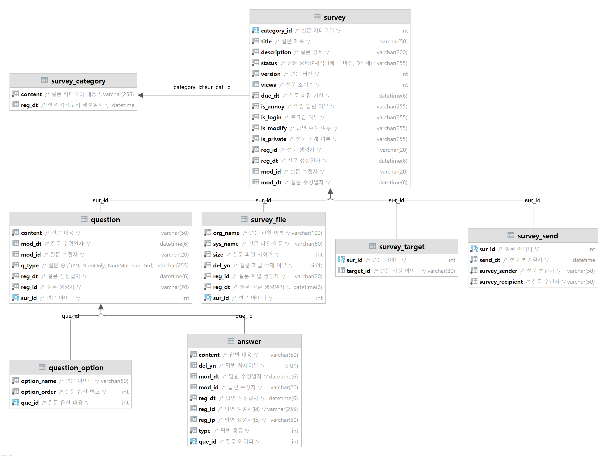
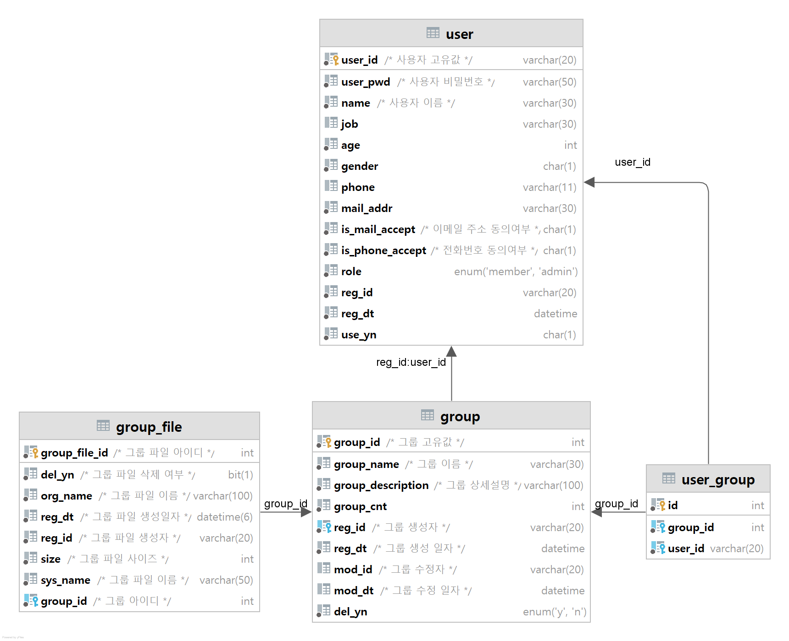

# 설문조사 기반 데이터 공유 플랫폼
## 개요
### 프로젝트 소개
- 설문조사 플랫폼: 설문 생성, 복제, 삭제 등 기본적인 설문 제작 서비스
- 설문 데이터 허브: 포인트 사용을 통한 전체공개 설문 조사 결과 열람 가능
### 기능 소개
0. 로그인, 회원가입, 회원정보수정, 회원탈퇴
1. 설문 생성, 수정, 삭제
2. 답변 생성, 수정, 삭제
3. 생성한 설문 및 답변한 설문 조회
4. 설문 분석 및 열람
5. 설문 허브 조회 및 구매
6. 그룹 생성, 수정, 삭제
7. 그룹 허브 조회 및 참여 
8. 관리자 기능
### 사용 기술
- Frontend: 

- Backend: 

- Database:

- CI/CD:

## 구현
### 1. MSA

|
Service
|
Url
|
|---|---|
|Eureka Service|https://github.com/solbiko/survey_platform_backend_eurekaserver.git|
|Gateway Service|https://github.com/solbiko/survey_platform_backend_gateway.git|
|Frontend Service|https://github.com/solbiko/survey_platform_frontend_react.git|
|Auth Service|https://github.com/solbiko/survey_platform_backend_auth.git|
|Analysis Service|https://github.com/OYJ-hansung/survey_platform_backend_analysis.git|
|Common Service|https://github.com/solbiko/survey_platform_backend_common.git|
|Point Service|https://github.com/stella693/survey_platform_backend_point.git|
|Survey Service|https://github.com/solbiko/survey_platform_backend_survey.git|
### 2. System Architecture

 - Kubernetes Manifest
  
    |
Service
|
Url
|
    |---|---|
    |Eureka Service|https://github.com/OYJ-hansung/eureka-manifest|
    |Gateway Service|https://github.com/OYJ-hansung/gateway-manifest|
    |Front Service|https://github.com/OYJ-hansung/front-manifest|
    |Auth Service|https://github.com/OYJ-hansung/auth-manifest|
    |Analysis Service|https://github.com/OYJ-hansung/analysis-manifest|
    |Common Service|https://github.com/OYJ-hansung/common-manifest|
    |Survey Service|https://github.com/OYJ-hansung/survey-manifest|

- Docker Image

  |
Service
|
Docker Hub Url
|
Docker Image
|
      |---|---|---|
  |Eureka Service|https://hub.docker.com/r/dhdudwn95/eureka|dhdudwn95/eureka:latest
  |Gateway Service|https://hub.docker.com/r/dhdudwn95/gateway|dhdudwn95/gateway:latest
  |Front Service|https://hub.docker.com/r/dhdudwn95/front|dhdudwn95/front:latest
  |Auth Service|https://hub.docker.com/r/dhdudwn95/auth|dhdudwn95/auth:latest
  |Analysis Service|https://hub.docker.com/r/dhdudwn95/analysis|dhdudwn95/analysis:latest
  |Common Service|https://hub.docker.com/r/dhdudwn95/common|dhdudwn95/common:latest
  |Survey Service|https://hub.docker.com/r/dhdudwn95/survey|dhdudwn95/survey:latest
  |Point Service|https://hub.docker.com/r/dhdudwn95/point|dhdudwn95/point:latest

### 3. Database
- Analysis DB: 설문 분석 정보 테이블

- Common DB: 플랫폼 기본 정보 테이블

- Point DB: 사용자 포인트 정보 테이블

- Survey DB: 설문, 질문, 답변 정보 테이블

- User DB: 사용자, 그룹 정보 테이블

